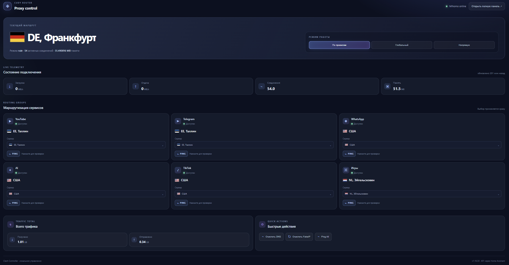

# Home Assistant Clash Controller — Mihomo Control
[](LICENSE)
[](https://hacs.xyz/)
[](https://github.com/myhades/ha-clash-controller)


A Home Assistant integration for controlling an external Clash instance (now [Mihomo](https://github.com/MetaCubeX/mihomo)) with an optional responsive Lovelace dashboard.

## Mihomo Control dashboard

This fork adds an optional, self-contained Lovelace dashboard for the
integration. It keeps the integration's existing entities and services, while
adding a responsive web interface with proxy-group cards, native Home
Assistant actions, latency checks, `Ping All`, and embedded SVG country flags.
The card never talks to the router API directly and contains no router token
or other credential.



Files:

- `www/mihomo-dashboard.js` — the custom Lovelace card;
- `dashboards/mihomo-dashboard.example.json` — an example card configuration.

The card header shows the installed Clash Controller integration version. The
version comes from the configured primary proxy selector's state attributes; it
appears after the integration has been updated and loaded by Home Assistant.
The card asset in `/config/www` is managed separately, so update that file when
you install a newer dashboard release.

### Dashboard installation

1. Install and configure the Clash Controller integration using one of the
   methods below.
2. Copy `www/mihomo-dashboard.js` to `/config/www/mihomo-dashboard.js`.
3. Add this Lovelace resource as a JavaScript module:

   ```yaml
   url: /local/mihomo-dashboard.js
   type: module
   ```

4. Add the card from
   `dashboards/mihomo-dashboard.example.json` to a dashboard. Replace
   `YOUR_CLASH_CONTROLLER_DEVICE_ID` and the entity IDs with the values from
   your Home Assistant instance.

The card uses the integration's `get_latency_service` for `PING` and `Ping
All`. The DNS and FakeIP buttons call the corresponding Home Assistant button
entities. All router addresses and device IDs stay in the local dashboard
configuration; do not commit them to a public repository.

This is not a Clash implementation or client. It is an external controller
designed as a Home Assistant integration to automate proxy control. The
integration backend is preserved from the upstream project; this fork adds the
Mihomo Control dashboard described above.

## Compatibility

This integration should work with most Clash cores and variants with Clash-compatible API. 
Known working clients: Nikki, OpenClash, ShellClash and MerlinClash.

Core support:

| Core Name       | Supported | Tested Version | Status |
|-----------------|-----------|----------------|--------|
| Clash           | Partially | v1.18.0        | End of life |
| Clash Premium   | Partially | 2023.08.17     | End of life |
| Clash Meta      | Partially | v1.16.0        | Legacy predecessor of Mihomo |
| Mihomo          | Yes       | v1.19.28       | Actively maintained |
## Installation

Home Assistant Core must be `2024.4.3` or newer. 

Choose your preferred installation method, and reboot Home Assistant afterward.

### Method 1: Through HACS

Navigate to "HACS" > "Clash Controller" or use the My button below.

[](https://my.home-assistant.io/redirect/hacs_repository/?owner=newuser2k&repository=ha-clash-controller&category=integration)

### Method 2: Manually

Download the repo and copy the folder `/custom_components/clash_controller` into your Home Assistant's `/config/custom_components` directory.

## Configuration

You'll need the API location (most likely with a port number) and the bearer token. Having a token set is required to use this integration.

To add the integration, navigate to "Settings"  > "Devices & services"  > "Add integration"  > "Clash Controller" or use the My button below. Then, follow the config flow. 

[](https://my.home-assistant.io/redirect/config_flow_start/?domain=clash_controller)

Notes:
1. If you can't find it in the integration list, make sure you've successfully installed the integration and rebooted. If so, try clearing the browser cache.
2. If your API location is an IP address, make sure it's static or assign a static DHCP lease for it. Location changes will require you to reconfigure the integration.
3. Both http and https are supported. If you're using a self-signed certificate, check the "Allow Unsafe SSL Certificates" box and use it only in a secured network.

## Usage

Availability of the following entities and services varies across cores.
Core capability is automatically detected at entry load, and unsupported entities will not be created.

### 1. Entities

- Proxy group and mode selectors
- Traffic, connection and memory sensors
- Provider counters and health-check buttons
- DNS and FakeIP cache flush buttons

### 2. Services

| Action | Description |
|--------|-------------|
| `reboot_core_service` | Reboot the selected Clash core. |
| `filter_connection_service` | Find active connections and optionally close them. |
| `get_latency_service` | Test the latency of a proxy group or node. |
| `dns_query_service` | Query a DNS record through the selected core. |
| `get_rule_service` | Find rules by type, payload or proxy. |
| `api_call_service` | Call any Clash-compatible API endpoint. |


Example call of getting available proxies:
```
action: clash_controller.api_call_service
data:
  device_id: [YOUR_DEVICE_ID]
  api_endpoint: proxies
  api_method: GET
response_variable: proxy_data
```


### 3. Additional Functions
This integration provides basic streaming service availability detection.
For this to work, Home Assistant must connect through the same proxy being tested, and this feature is off by default.
To enable/disable this feature, navigate to "Settings"  > "Devices & services"  > "Clash Controller"  > "Options".

Currently supported service(s): Netflix.

## Known Issue
If you're connecting to a Clash behind a reverse proxy server, some real-time sensors will not work and thus not generated. I'm still working on this.

## Feedback
To report an issue, please include details about your Clash configuration such as client type, core type and core version, along with debug logs of this integration.
You can enable debug logging in the UI (if possible) or add the following to your Home Assistant configuration:
```
logger:
  default: warning
  logs:
    custom_components.clash_controller: debug
    custom_components.clash_controller.sensor: debug
```

## Disclaimer

This integration is solely for controlling Clash and is not responsible for any actions taken by users while using Clash. The user is fully responsible for ensuring that their use of Clash complies with all applicable laws and regulations. Neither the owner nor the contributors to this repository make any warranties regarding the accuracy, legality, or appropriateness of Clash or its use.

By using this integration, you acknowledge and agree to this disclaimer.
